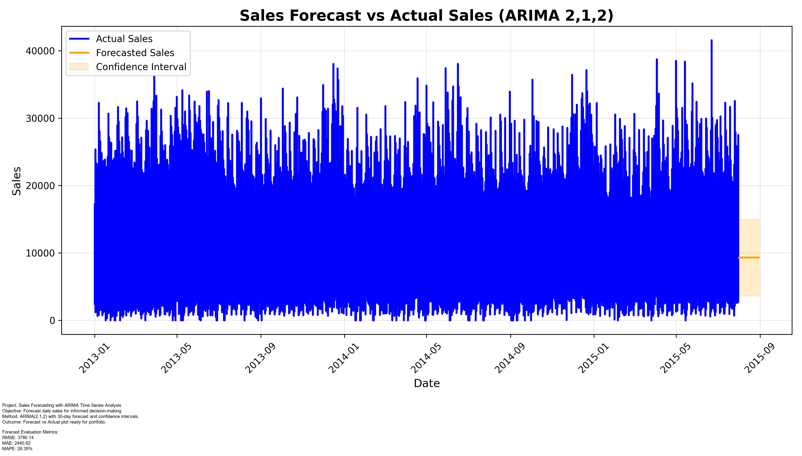

# Sales Forecasting Portfolio

## Author
**Raphael Tankeu Buguieu**

---

## Project Overview
This project demonstrates **end-to-end sales forecasting** using historical daily sales data from 2013–2015.  
The goal was to forecast the next 30 days of sales using ARIMA, evaluate forecast accuracy, and present results in a **portfolio-ready visualization**.

---

## Methodology
1. **Data Cleaning & Preprocessing**: Handled missing values and prepared the time series.  
2. **Forecasting**: Applied ARIMA(2,1,2) using Python (`statsmodels` and `pmdarima`) to predict 30 days ahead.  
3. **Evaluation**: Calculated RMSE, MAE, and MAPE to measure forecast accuracy.  
4. **Visualization**: Compared actual vs forecasted sales with confidence intervals.  
5. **Portfolio Slide**: Combined plot, summary, and evaluation metrics into a professional slide for presentation.

---

## Portfolio Slide

---

## Forecast Evaluation Metrics
- **RMSE**: 3780.14  
- **MAE**: 2440.62  
- **MAPE**: 26.35%

These metrics quantify the accuracy of the forecast and are included in the portfolio slide.

---

## Project Structure